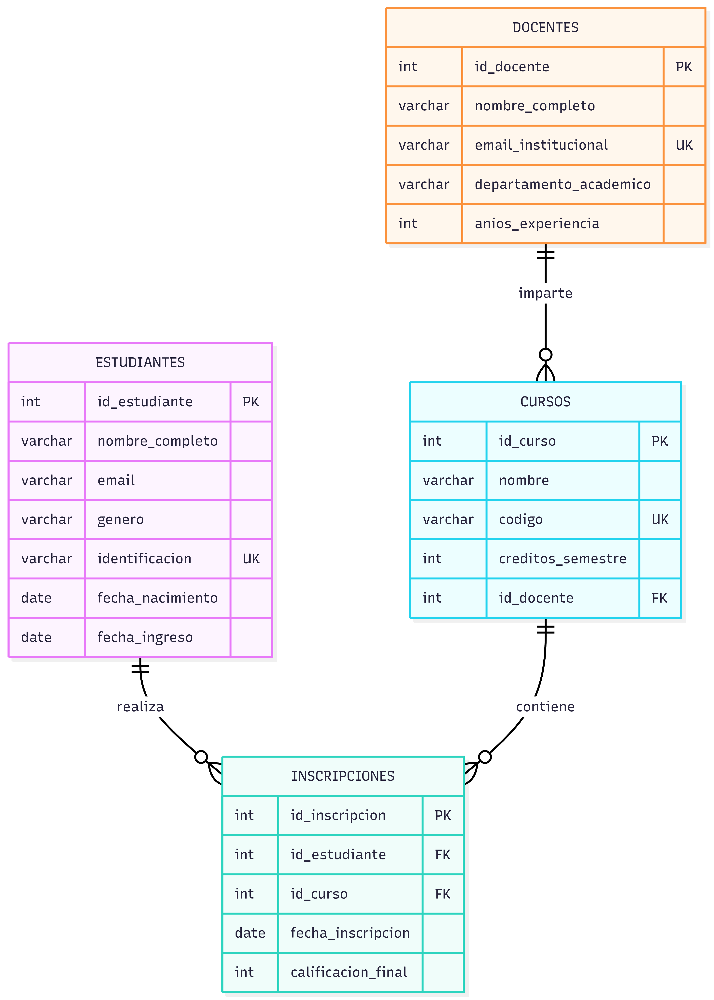

#  Sistema de Gestión Académica en SQL

Este proyecto implementa un sistema académico relacional utilizando **MySQL**, donde se gestionan:

- Estudiantes
- Docentes
- Cursos
- Inscripciones
- Carreras
- Indicadores académicos
- Vistas
- Roles y permisos
- Transacciones



---

#  1. Creación de la Base de Datos

##  Tabla: estudiantes

```sql
CREATE TABLE estudiantes (
	id_estudiante INT PRIMARY KEY AUTO_INCREMENT,
	nombre_completo VARCHAR(100) NOT NULL,
	email VARCHAR(100) NOT NULL,
	genero ENUM('masculino', 'femenino', 'otro') NOT NULL,
	identificacion VARCHAR(20) NOT NULL UNIQUE,
	fecha_nacimiento DATE,
	fecha_ingreso DATE
);
```

---

## Tabla: docentes

```sql
CREATE TABLE docentes (
	id_docente INT PRIMARY KEY AUTO_INCREMENT,
	nombre_completo VARCHAR(100) NOT NULL,
	email_institucional VARCHAR(100) NOT NULL UNIQUE,
	departamento_academico VARCHAR(100) NOT NULL,
	anios_experiencia INT NOT NULL
);
```

---

##  Tabla: cursos

```sql
CREATE TABLE cursos (
	id_curso INT PRIMARY KEY AUTO_INCREMENT,
	nombre VARCHAR(100) NOT NULL,
	codigo VARCHAR(20) NOT NULL UNIQUE,
	creditos_semestre INT NOT NULL,
	id_docente INT,
	FOREIGN KEY (id_docente) REFERENCES docentes(id_docente)
);
```

---

##  Tabla: inscripciones

```sql
CREATE TABLE inscripciones (
	id_inscripcion INT PRIMARY KEY AUTO_INCREMENT,
	id_estudiante INT NOT NULL,
	id_curso INT NOT NULL,
	fecha_inscripcion DATE NOT NULL,
	calificacion_final DECIMAL(4,2),

	FOREIGN KEY (id_estudiante) REFERENCES estudiantes(id_estudiante),
	FOREIGN KEY (id_curso) REFERENCES cursos(id_curso),

	UNIQUE (id_estudiante, id_curso)
);
```

---

#  2. Inserción de Datos

## INSERT Estudiantes

```sql
INSERT INTO estudiantes 
(nombre_completo, email, genero, identificacion, fecha_nacimiento, fecha_ingreso)
VALUES
('Juan Pérez', 'juan@email.com', 'masculino', '1001234567', '2002-05-14', '2024-01-15'),
('María Gómez', 'maria@email.com', 'femenino', '1009876543', '2001-08-22', '2024-01-15'),
('Carlos Rodríguez', 'carlos@email.com', 'masculino', '1012345678', '2003-03-10', '2024-01-15'),
('Laura Martínez', 'laura@email.com', 'femenino', '1098765432', '2002-11-30', '2024-01-15'),
('Andrés Torres', 'andres@email.com', 'otro', '1023456789', '2000-07-19', '2024-01-15');
```

---

## INSERT Docentes

```sql
INSERT INTO docentes
(nombre_completo, email_institucional, departamento_academico, anios_experiencia)
VALUES
('Carlos Ramírez', 'c.ramirez@universidad.edu', 'Ingeniería de Sistemas', 10),
('Ana Torres', 'a.torres@universidad.edu', 'Matemáticas', 8),
('Luis Fernández', 'l.fernandez@universidad.edu', 'Administración', 12);
```

---

## INSERT Cursos

```sql
INSERT INTO cursos
(nombre, codigo, creditos_semestre, id_docente)
VALUES
('Base de Datos', 'BD101', 4, 1),
('Cálculo I', 'MAT101', 3, 2),
('Administración Financiera', 'ADM201', 3, 3),
('Programación Web', 'PW202', 4, 1);
```

---

## INSERT Inscripciones

```sql
INSERT INTO inscripciones
(id_estudiante, id_curso, fecha_inscripcion, calificacion_final)
VALUES
(1, 1, '2024-02-01', 4.50),
(2, 1, '2024-02-01', 3.80),
(3, 2, '2024-02-02', 4.20),
(4, 2, '2024-02-02', 3.60),
(5, 3, '2024-02-03', 4.00),
(1, 3, '2024-02-03', 4.70),
(2, 4, '2024-02-04', 3.90),
(3, 4, '2024-02-04', 4.30);
```

---

#  3. Consultas Académicas

## Listar estudiantes con sus cursos

```sql
SELECT 
	e.id_estudiante,
	e.nombre_completo,
	c.nombre AS curso,
	c.codigo,
	i.fecha_inscripcion,
	i.calificacion_final
FROM estudiantes e
INNER JOIN inscripciones i 
	ON e.id_estudiante = i.id_estudiante
INNER JOIN cursos c 
	ON i.id_curso = c.id_curso
ORDER BY e.nombre_completo;
```

---

## Promedio por curso

```sql
SELECT 
	c.id_curso,
	c.nombre AS curso,
	c.codigo,
	AVG(i.calificacion_final) AS promedio_calificacion
FROM cursos c
INNER JOIN inscripciones i 
	ON c.id_curso = i.id_curso
GROUP BY c.id_curso, c.nombre, c.codigo
ORDER BY promedio_calificacion DESC;
```

---

## Estudiantes con más de 1 curso

```sql
SELECT 
	e.id_estudiante,
	e.nombre_completo,
	COUNT(i.id_curso) AS total_cursos
FROM estudiantes e
INNER JOIN inscripciones i 
	ON e.id_estudiante = i.id_estudiante
GROUP BY e.id_estudiante, e.nombre_completo
HAVING COUNT(i.id_curso) > 1;
```

---

#  4. Indicadores con Funciones Agregadas

## ROUND

```sql
SELECT ROUND(AVG(calificacion_final), 2) AS promedio_general
FROM inscripciones;
```

## COUNT

```sql
SELECT COUNT(DISTINCT id_estudiante) AS total_estudiantes
FROM inscripciones;
```

## MAX - MIN

```sql
SELECT 
	MAX(calificacion_final) AS nota_maxima,
	MIN(calificacion_final) AS nota_minima
FROM inscripciones;
```

## SUM

```sql
SELECT 
	d.nombre_completo,
	SUM(c.creditos_semestre) AS total_creditos
FROM docentes d
INNER JOIN cursos c 
	ON d.id_docente = c.id_docente
GROUP BY d.nombre_completo;
```

---

# 5. Vista Académica

```sql
CREATE VIEW vista_historial_academico AS
SELECT 
	e.nombre_completo AS estudiante,
	c.nombre AS curso,
	d.nombre_completo AS docente,
	c.semestre,
	i.calificacion_final
FROM inscripciones i
INNER JOIN estudiantes e 
	ON i.id_estudiante = e.id_estudiante
INNER JOIN cursos c 
	ON i.id_curso = c.id_curso
INNER JOIN docentes d 
	ON c.id_docente = d.id_docente;
```

Consultar vista:

```sql
SELECT * FROM vista_historial_academico;
```

---

#  6. Control de Acceso

## Crear Rol

```sql
CREATE ROLE revisor_academico;
```

## Otorgar permisos

```sql
GRANT SELECT 
ON vista_historial_academico 
TO revisor_academico;
```

## Revocar permisos de modificación

```sql
REVOKE INSERT, UPDATE, DELETE
ON inscripciones
FROM revisor_academico;
```

---

#  7. Transacciones

```sql
BEGIN;

UPDATE inscripciones
SET calificacion_final = 4.80
WHERE id_inscripcion = 1;

SAVEPOINT despues_primera_actualizacion;

UPDATE inscripciones
SET calificacion_final = 2.00
WHERE id_inscripcion = 2;

ROLLBACK TO despues_primera_actualizacion;

COMMIT;
```

---

#  Conclusión

Este proyecto demuestra:

- Modelado relacional completo
- Integridad referencial
- Consultas avanzadas con JOIN, GROUP BY, HAVING
- Funciones agregadas
- Vistas
- Roles y permisos
- Control de transacciones
- Buenas prácticas en SQL

---

Proyecto listo para portafolio profesional.
