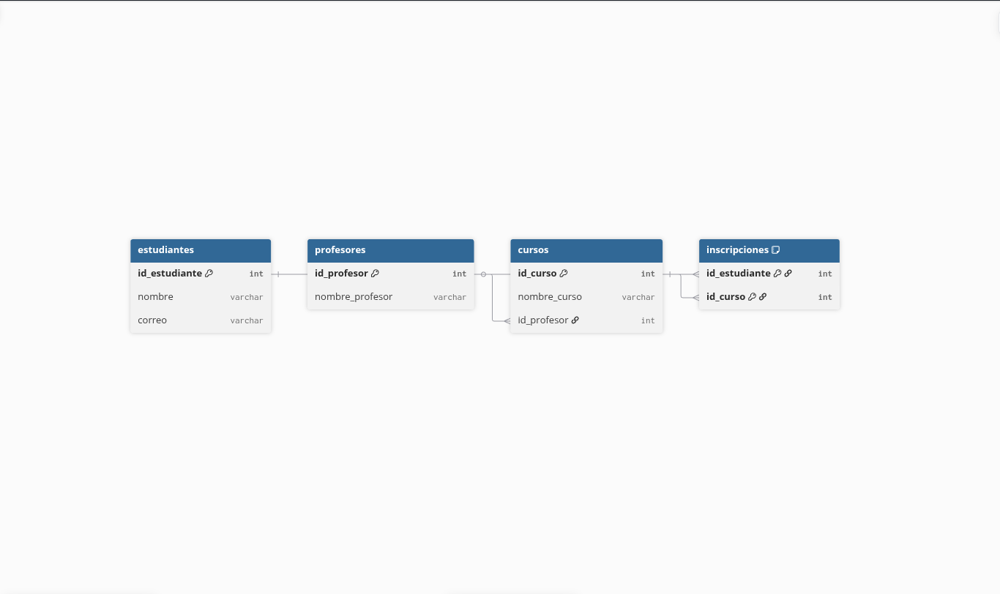
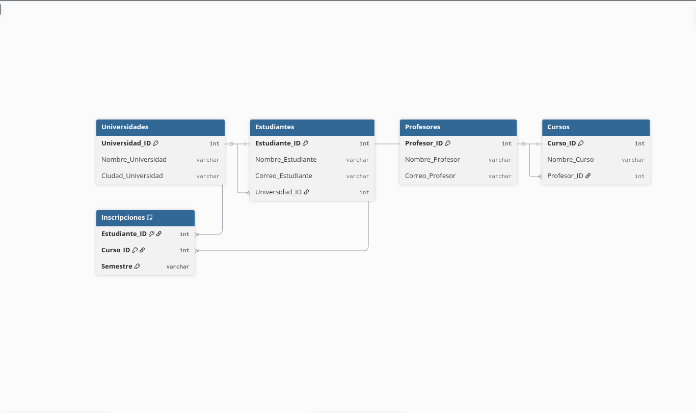
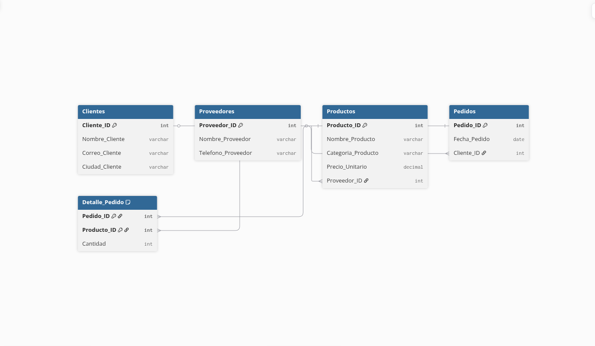
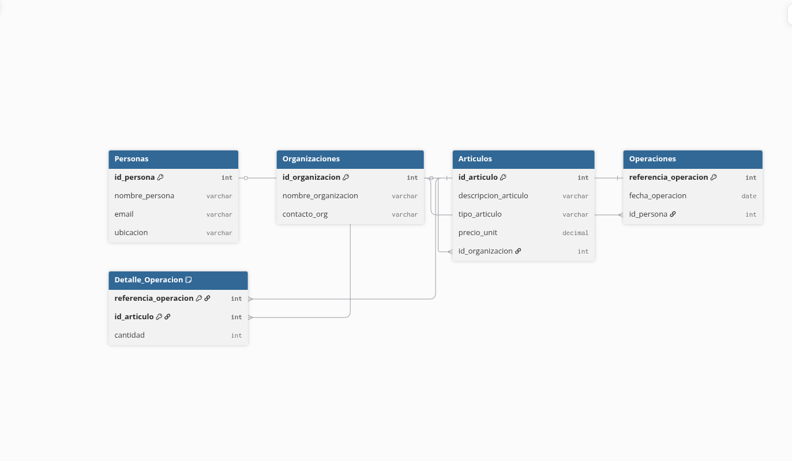

# Normalización de Bases de Datos

En esta sección se presentan cuatro ejercicios prácticos de normalización llevados hasta Tercera Forma Normal (3FN).  

El objetivo fue eliminar redundancia, dependencias parciales y dependencias transitivas para obtener modelos relacionales limpios y consistentes.

---

# Ejercicio 1 — Estudiantes y Cursos

## Problema

Una sola tabla contenía información de estudiantes, cursos y profesores.  
Se repetían datos del estudiante y del curso en múltiples registros.

## Solución

Se separó la información en tres entidades:

- Estudiantes  
- Cursos  
- Inscripciones  

Se resolvió la relación muchos a muchos y se eliminó la redundancia.

---

# Ejercicio 2 — Universidad, Cursos y Profesores

## Problema

La tabla incluía información de estudiantes, universidad, ciudad, cursos, profesores y semestre en una sola estructura.

Se detectaron:

- Dependencias transitivas  
- Datos duplicados  
- Mezcla de múltiples entidades  

## Solución

Se dividió en las siguientes entidades:

- Universidades  
- Estudiantes  
- Profesores  
- Cursos  
- Inscripciones  

Se eliminaron dependencias transitivas y redundancia.

---

# Ejercicio 3 — Sistema de Pedidos

## Problema

Una única tabla almacenaba información de pedido, cliente, producto, proveedor y total del pedido.

Problemas identificados:

- Cliente repetido  
- Producto repetido  
- Proveedor repetido  
- Campo derivado (Total_Pedido)  

## Solución

Se estructuró el modelo en:

- Clientes  
- Proveedores  
- Productos  
- Pedidos  
- Detalle_Pedido  

El total del pedido se calcula dinámicamente para evitar inconsistencias.

---

# Ejercicio 4 — Operaciones y Artículos

## Problema

La tabla contenía información de operación, persona, artículo y organización en una sola estructura.

Se detectaron:

- Dependencias transitivas  
- Datos repetidos  
- Campo calculado (valor_total_operacion)  

## Solución

Se dividió en:

- Personas  
- Organizaciones  
- Articulos  
- Operaciones  
- Detalle_Operacion  

El valor total se obtiene mediante cálculo dinámico para mantener integridad de datos.

---

# Conclusión

En los cuatro ejercicios se aplicaron correctamente:

- Primera Forma Normal (1FN)  
- Segunda Forma Normal (2FN)  
- Tercera Forma Normal (3FN)  

Resultado:

- Eliminación de redundancia  
- Eliminación de dependencias parciales y transitivas  
- Modelos relacionales organizados  
- Mejor integridad y consistencia de datos  
